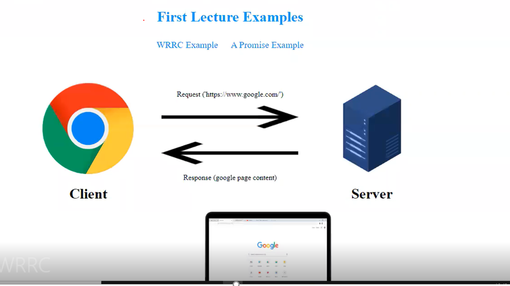

# Movies-Library
# Project Name - Project Version

**Movies Library**

## Overview

## Getting Started
1. Created a repository called Movies-Library on  my GitHub

2. Initialized my project 

3. Created a new branch called Task11

4. Builded Home page  with a method of get and a path of /. 

5. Builded Favorite page  with a method of get and a path of /favorite.

6. Builded Handle errors (staus 500 +staus 404)

## Project Features
<!-- What are the features included in you app -->

 

### What observations or questions do you have about what you’ve learned so far?
i need more time for study Lessons taken

### How long did it take you to complete this assignment? And, before you started, how long did you think it would take you to complete this assignment?
14 hours